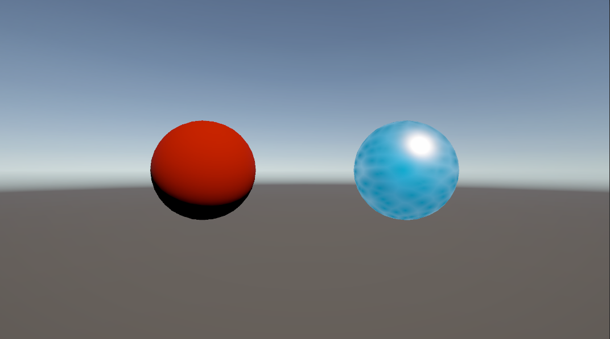

# はじめに
プログラムワークショップⅣの4つ目の管理用です

# 結果画像

- 工夫した点：VoronoiノードとFresnel Effectノードを使って水面の波紋を作り、Checkerboardノードで水の色を青と水色の混色で設定した。
- また、CheckerboardのXYやVoronoiノードのCellDensity、AngleOffsetなどのマテリアルを設定するオブジェクトで調整が必要だと思ったところは変数を作成した。
- VoronoiノードのAngleOffsetの値をスクリプトで操作できるように変更すると波紋が動いているように見えより水面ぽくなるかもしれないとも考えた。
- 

# 進め方

- 本リポジトリ(tpu-game-2025/PGWS4_4)をforkしてください。
- fork先のリポジトリを更新してください
- Unityのプロジェクトをsrc内で進めて下さい。
- 結果を画面キャプチャして、画像としてリポジトリに追加して、上記のリンクから見れるようにしてください。
- 完成したら本リポジトリのmainブランチにpull requestを投げてください

